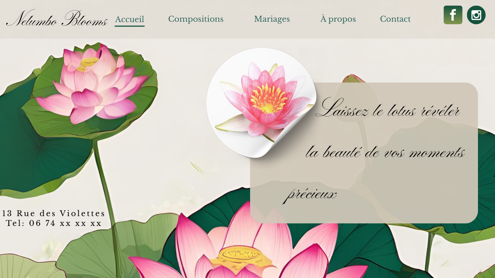

# 💐 Site Vitrine - Fleuriste

Bienvenue sur le dépôt de mon tout premier site vitrine dédié à l’univers floral.  
Ce projet met en valeur l’esthétique d’une **boutique de fleurs** à travers un design épuré et naturel, conçu entièrement en **HTML5** et **CSS3**.

---

## 🌷 Aperçu du site

> Un site vitrine responsive pensé pour un fleuriste :  
> **élégant, doux et accueillant**, à l’image d’un atelier floral artisanal.

🔗 [Voir le site en ligne](https://github.com/dechiaraluca/site-vitrine)
📱 Compatible mobile, tablette et ordinateur  
🎨 Design inspiré de la nature (lotus, typographies douces)

---

## 🛠️ Technologies utilisées

- **HTML5** : structure sémantique propre
- **CSS3** : mise en page avec Flexbox, responsive design, animations légères
- **Google Fonts** : typographie florale et raffinée

---

## 📁 Arborescence du projet 🌸

```

.
├── index.html
├── style.css
├── maquette/
│   ├── page_accueil.png
│   ├── compositions.png
│   └── weddings.png
│   └── about.png
│   └── contact.png
└── README.md

```

---

## 🌿 Fonctionnalités

- Accueil doux et chaleureux 
- Présentation des services : compositions avec carrousel d'images, événements: mariages
- Mise en avant d'une page biographique et une page contact (formulaire + maps)
- Responsive design pour une navigation fluide sur tous les écrans

---

## 📸 Aperçu visuel



---

## ✨ Améliorations futures

- [ ] Carrousel déroulant (droite-gauche)
- [ ] Optimisation SEO (balises meta, titres, description)

---

## 📬 Me contacter

📧 **l.dechiara.dev@gmail.com**
📍 **Grenoble, France**

---

> Merci d’avoir visité ce projet. Que vos journées soient aussi fleuries que ce site 🌸
```